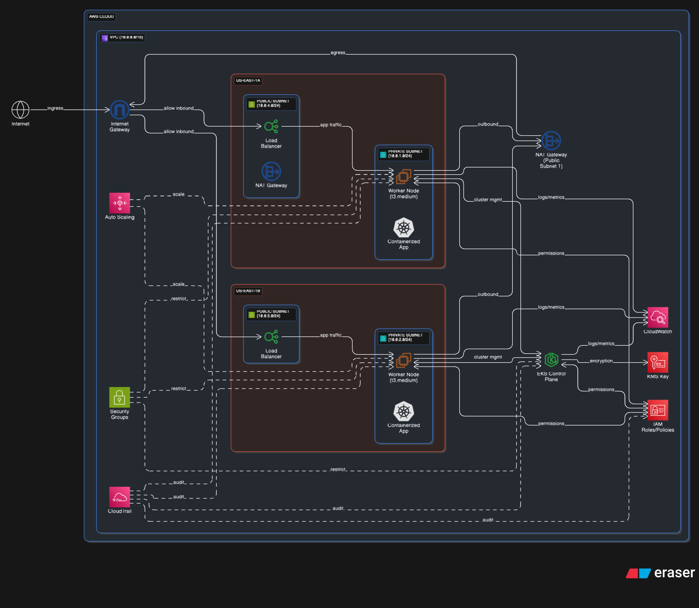

# EKS Cluster with Worker Nodes + IAM Roles



# EKS Cluster with Worker Nodes + IAM Roles

This Terraform configuration creates a production-ready Amazon EKS (Elastic Kubernetes Service) cluster with managed node groups, VPC networking, and all necessary IAM roles and security groups.

## Architecture Overview

- **VPC**: Custom VPC with public and private subnets across 2 availability zones
- **EKS Cluster**: Kubernetes version 1.27 with private endpoint access
- **Node Groups**: Managed node group with t3.medium instances (2-6 nodes, desired 2)
- **Security**: Proper security groups and IAM roles for cluster and worker nodes
- **Encryption**: KMS encryption for EKS secrets
- **Logging**: CloudWatch logging enabled for API server, audit, and authenticator

## Prerequisites

1. **AWS CLI** configured with appropriate credentials
2. **Terraform** >= 1.0 installed
3. **kubectl** for cluster management
4. **AWS Profile** named `terraform-prod` configured

### AWS Profile Setup
```bash
aws configure --profile terraform-prod
# Enter your AWS Access Key ID, Secret Access Key, and region
```

## Quick Start

1. **Clone and Initialize**
   ```bash
   git clone <repository-url>
   cd "EKS Cluster with Worker Nodes + IAM Roles"
   terraform init
   ```

2. **Review Plan**
   ```bash
   terraform plan
   ```

3. **Deploy Infrastructure**
   ```bash
   terraform apply
   ```

4. **Configure kubectl**
   ```bash
   aws eks update-kubeconfig --name <cluster-name> --region us-east-1 --profile terraform-prod
   ```

## Configuration

### Variables

| Variable | Default | Description |
|----------|---------|-------------|
| `kubernetes_version` | 1.27 | Kubernetes version for EKS cluster |
| `vpc_cidr` | 10.0.0.0/16 | CIDR block for VPC |
| `aws_region` | us-west-1 | AWS region for deployment |

### Customization

Edit `variables.tf` to modify default values:

```hcl
variable "kubernetes_version" {
  default     = 1.27
  description = "kubernetes version"
}

variable "aws_region" {
  default = "us-east-1"  # Change region if needed
  description = "aws region"
}
```

## Infrastructure Components

### VPC Configuration
- **CIDR**: 10.0.0.0/16
- **Private Subnets**: 10.0.1.0/24, 10.0.2.0/24
- **Public Subnets**: 10.0.4.0/24, 10.0.5.0/24
- **NAT Gateway**: Single NAT gateway for cost optimization
- **DNS**: DNS hostnames and support enabled

### EKS Cluster
- **Version**: Kubernetes 1.27
- **Endpoint Access**: Private endpoint only (secure)
- **Logging**: API server, audit, and authenticator logs
- **IRSA**: IAM Roles for Service Accounts enabled
- **Encryption**: KMS encryption for secrets

### Managed Node Group
- **Instance Type**: t3.medium
- **AMI**: Amazon Linux 2
- **Scaling**: Min 2, Max 6, Desired 2 nodes
- **Subnets**: Deployed in private subnets
- **Launch Template**: Custom template with monitoring enabled

## Security Features

### Security Groups
- **Cluster Security Group**: Controls cluster API access
- **Node Security Group**: Controls worker node communication
- **Worker Management**: Additional security group for management access

### IAM Roles
- **Cluster Service Role**: EKS cluster permissions
- **Node Instance Role**: Worker node permissions
- **OIDC Provider**: For Kubernetes service accounts

### Network Security
- Private subnets for worker nodes
- Public subnets only for load balancers
- Restricted security group rules
- VPC endpoint support

## Outputs

After successful deployment, you'll get:

```bash
cluster_endpoint = "https://xxxxx.gr7.us-east-1.eks.amazonaws.com"
cluster_id = "abhi-eks-xxxxxxxx"
cluster_security_group_id = "sg-xxxxxxxxx"
oidc_provider_arn = "arn:aws:iam::xxxxxx:oidc-provider/oidc.eks.us-east-1.amazonaws.com/id/xxxxx"
region = "us-east-1"
```

## Post-Deployment Steps

1. **Verify Cluster Status**
   ```bash
   kubectl get nodes
   kubectl get pods --all-namespaces
   ```

2. **Install Essential Add-ons**
   ```bash
   # AWS Load Balancer Controller
   kubectl apply -k "github.com/aws/eks-charts/stable/aws-load-balancer-controller//crds?ref=master"
   
   # Cluster Autoscaler
   kubectl apply -f https://raw.githubusercontent.com/kubernetes/autoscaler/master/cluster-autoscaler/cloudprovider/aws/examples/cluster-autoscaler-autodiscover.yaml
   ```

3. **Deploy Sample Application**
   ```bash
   kubectl create deployment nginx --image=nginx
   kubectl expose deployment nginx --port=80 --type=LoadBalancer
   ```

## Cost Optimization

- Single NAT Gateway reduces costs
- t3.medium instances provide good price/performance
- Managed node groups reduce operational overhead
- Spot instances can be enabled for non-production workloads

## Monitoring and Logging

- CloudWatch logging enabled for EKS control plane
- VPC Flow Logs can be enabled if needed
- Container Insights can be added for detailed monitoring

## Troubleshooting

### Common Issues

1. **Authentication Issues**
   ```bash
   aws sts get-caller-identity --profile terraform-prod
   ```

2. **kubectl Connection Issues**
   ```bash
   aws eks update-kubeconfig --name <cluster-name> --region us-east-1 --profile terraform-prod
   ```

3. **Node Group Not Ready**
   ```bash
   kubectl describe nodes
   kubectl get events --sort-by=.metadata.creationTimestamp
   ```

## Cleanup

To destroy all resources:

```bash
terraform destroy
```

**Warning**: This will delete all resources including the EKS cluster, VPC, and associated data.

## File Structure

```
.
├── README.md                 # This file
├── versions.tf              # Terraform and provider versions
├── variables.tf             # Input variables
├── vpc.tf                   # VPC configuration
├── eks-cluster.tf           # EKS cluster configuration
├── security-groups.tf       # Security group rules
└── outputs.tf              # Output values
```

## Support

For issues and questions:
- Check AWS EKS documentation
- Review Terraform AWS EKS module documentation
- Examine CloudWatch logs for cluster issues

## License

This project is licensed under the MIT License.
